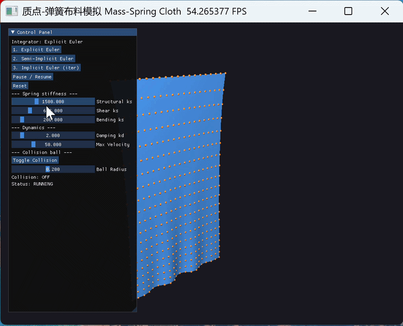
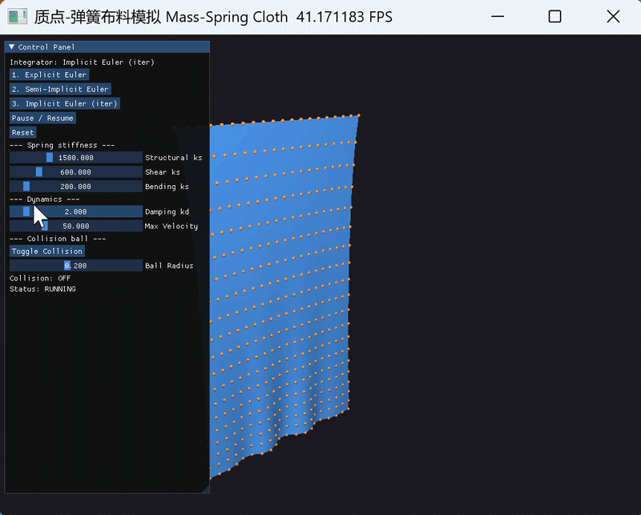
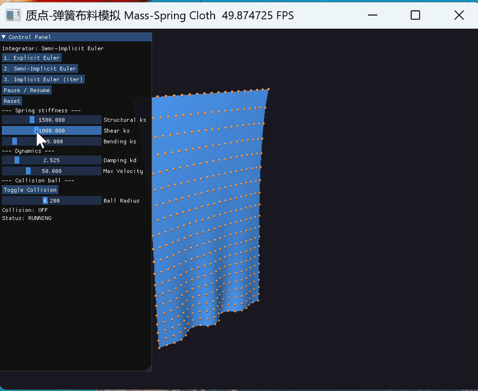
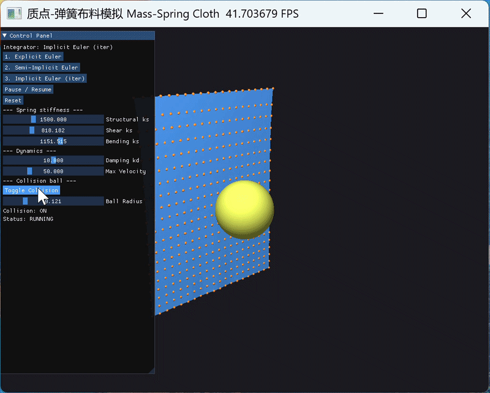

# 质点-弹簧布料模拟 (Mass-Spring Cloth Simulation)
姓名：王昱彤  学号：202411081029  专业：计算机科学与技术（公费师范）

基于 **Taichi** 的 3D 布料动态模拟：实现并对比三种数值积分求解器，配 GGUI 实时交互面板。
在基础要求之上，额外完成了**剪切/弯曲弹簧**与**球体碰撞**两项选做，并把核心物理/数值参数全部做成可实时拖动的滑条。

---

## 📽️ 演示

**三种积分方法对比**



**阻尼对比 kd=1.0 vs kd=5.0**



**选做：剪切/弯曲弹簧（布料更挺括）**



**选做：球体碰撞**



---

## 1. 功能

- 20×20 质点网格，胡克定律弹力 + 阻尼力 + 重力。
- 三种积分器实时切换：
  - **显式欧拉** Explicit Euler —— 最不稳定，`dt`/`ks` 稍大即爆。
  - **半隐式欧拉** Semi-Implicit / Symplectic —— 能量近似守恒，稳定性好。
  - **隐式欧拉** Implicit / Backward（定点迭代近似）—— 最稳定，阻尼感强。
- 速度钳制（`clamp_velocity`）防数值爆炸。
- **[选做1] 三类弹簧**：结构(Structural) + 剪切(Shear) + 弯曲(Bending)，各自劲度可独立调节，置 0 即关闭该类。
- **[选做2] 球体碰撞**：场景中放置一个可开关、可调半径的球，布料下垂时与其碰撞、被托住。
- GGUI 控制面板：切换方法、暂停/继续、重置、碰撞开关，并实时调节全部关键参数。
- 鼠标右键拖拽旋转相机。

## 2. ✨ 创新点：参数全部实时可调

实验只要求把模拟跑起来、按方法切换，本项目把模拟最核心的物理量与数值量全部暴露成 GGUI 滑条，**无需改代码、无需重启**即可做参数研究：

| 滑条 | 物理/数值含义 | 调大现象 |
| --- | --- | --- |
| `Damping kd` | 阻尼力 `f_d = -kd·v` 的系数，能量耗散快慢 | 摆动迅速被压住、很快静止 |
| `Structural ks` | 结构弹簧劲度（胡克定律中的 `ks`），布料抗拉伸程度 | 布料更挺括、下垂减小；过大时显式欧拉先发散 |
| `Shear ks` | 剪切弹簧劲度，抵抗网格被「斜向剪歪」 | 布料抗扭曲、不易塌成菱形 |
| `Bending ks` | 弯曲弹簧劲度，抵抗布料折弯 | 布料更硬挺、褶皱更少 |
| `Max Velocity` | 速度钳制上限（纯数值防爆参数） | 允许更剧烈运动；过小会人为拖慢布料 |
| `Ball Radius` | 碰撞球半径 | 球更大、托起的布料更高 |

这一设计直接服务于实验目标「对比不同积分方法的稳定性」：把 `Structural ks` 拖大，再在三种积分器间切换，可以**肉眼看到**显式欧拉最先抖动发散、半隐式次之、隐式最稳——参数与方法的耦合一目了然。

## 3. 环境与运行

```bash
pip install -r requirements.txt
python cloth_simulation.py
```

> 默认用 GPU。无 GPU 时切 CPU 调试：`CLOTH_ARCH=cpu python cloth_simulation.py`
> （`CLOTH_ARCH` 可取 `cpu / cuda / vulkan / metal / gpu`）。GGUI 窗口需要桌面显示环境。

## 4. 操作说明

| 控件 | 作用 |
| --- | --- |
| `1/2/3` 按钮 | 切换 显式 / 半隐式 / 隐式 积分方法 |
| `Pause / Resume` | 暂停 / 继续 |
| `Reset` | 重置布料到初始平铺状态 |
| `Toggle Collision` | 开/关 碰撞球 |
| 各滑条 | 见上表，实时调参 |
| 鼠标右键拖拽 | 旋转视角 |

> **面板文字用英文**：GGUI 内置 imgui 默认字体不含中文字形，中文会显示成方块，故按钮用英文标签，中文提示打印在控制台。

## 5. 数值方法对比（实验参考效果）

固定 `ks`、`dt`，对比**半隐式欧拉**下两组阻尼：

| 阻尼 `kd` | 现象 |
| --- | --- |
| `2.0` | 下垂幅度大、来回摆动明显、收敛慢 |
| `7.0` | 摆动迅速被抑制、很快趋于静止悬挂形态 |

切到**显式欧拉**并逐步增大 `Structural ks`（或源码里调大 `DT`），即可观察显式欧拉先于另两种方法发散（位置剧烈抖动、被速度钳制反复拉回），直观体现稳定性差异。

## 6. 选做内容说明

### 6.1 完善弹簧模型（剪切 + 弯曲）

- **结构弹簧**：相邻质点（上下、左右）相连，抵抗拉伸。
- **剪切弹簧**：每个网格 quad 的两条对角线相连，抵抗布料被「剪切」成菱形。
- **弯曲弹簧**：隔一个质点相连（`(i,j)-(i,j+2)`、`(i,j)-(i+2,j)`），抵抗折弯，使布料更硬挺。

实现上三类弹簧拼接进同一个 `spring` 场，用 `spring_type` 标记类别，`compute_forces_on()` 按类别选用 `ks / ks_shear / ks_bend`。把 `Shear ks`、`Bending ks` 拖到 0 即只剩结构弹簧，可对比布料形态变化（只有结构弹簧时布料松垮、易塌；加上剪切弯曲后明显更挺括）。

### 6.2 球体碰撞

每步物理更新后调用 `resolve_collision()`：若质点落入球内，则把它投影回球面外侧、并消去指向球心的法向速度分量（无摩擦近似）。点击 `Toggle Collision` 开启后，下垂的布料会被球托住、贴合球面。

## 7. 代码结构与架构要点

```
mass-spring-cloth/
├── cloth_simulation.py   # 全部逻辑
├── requirements.txt
├── README.md
├── .gitignore
└── docs/                 # 放演示 gif / 截图
```

- **任务1 初始化拆分**：`init_positions → init_springs → init_mesh_indices` 三个 `@ti.kernel` 按序调用；`init_springs` 依赖 `init_positions` 写好的位置算原长，Kernel 边界即隐式同步屏障。
- **任务2 力学与防爆**：`compute_forces_on / clamp_velocity / resolve_collision` 用 `@ti.func` 编译时内联；弹簧力用 `ti.atomic_add` 累加到两端避免写冲突。
- **任务3 积分器**：三个积分器各为单个 `@ti.kernel`，算力+更新+钳制+碰撞合并在一个 Kernel；隐式欧拉用 `ti.static(range(...))` 编译期展开定点迭代，单次 Kernel 启动完成全部迭代。
- **任务4 渲染交互**：`ti.ui.Window` + `scene.mesh / scene.particles` 渲染；`window.GUI` 构建面板。`ti.ui.Scene()` 新版被标记 deprecated，代码优先 `window.get_scene()` 并保留回退。

## 8. 主要可调参数（源码顶部）

| 参数 | 含义 | 默认 |
| --- | --- | --- |
| `N` | 网格分辨率 N×N | 20 |
| `DT` | 时间步长 | 5e-4 |
| `SUBSTEPS` | 每帧子步数 | 30 |
| `IMPLICIT_ITERS` | 隐式欧拉定点迭代次数 | 15 |
| `ks/ks_shear/ks_bend/kd/max_vel` | 各类劲度/阻尼/速度上限（运行时可调） | 2000/800/300（默认见 main）/2/50 |

